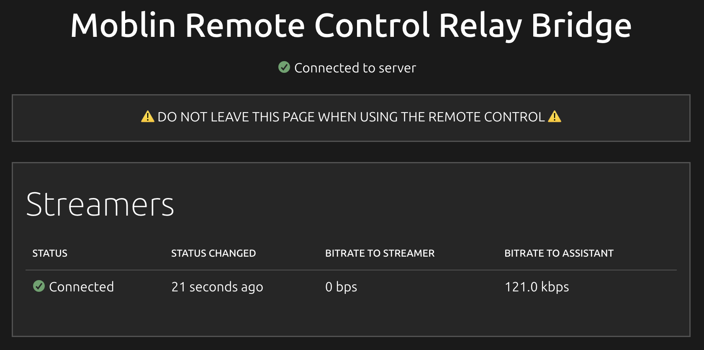

# Moblin Remote Control Relay

Example server: https://mys-lang.org/moblin-remote-control-relay



# Cloud service

A simple Go program serves a simple website and websocket endpoints.

Run the Go program as a systemd service and use Nginx for TLS.

```
cd backend && go build
```

## Systemd service

/etc/systemd/system/moblin-remote-control-relay.service

``` ini
[Unit]
Description=Moblin Remote Control Relay
After=network.target
StartLimitIntervalSec=0

[Service]
Type=simple
Restart=always
RestartSec=1
User=erik
ExecStart=/home/erik/moblin-remote-control-relay/backend/moblin-remote-control-relay -address localhost:9998 -reverse_proxy_base /moblin-remote-control-relay
WorkingDirectory=/home/erik/moblin-remote-control-relay/backend
KillSignal=SIGINT

[Install]
WantedBy=multi-user.target
```

Enable it for automatic start at boot.

```
sudo systemctl enable moblin-remote-control-relay
```

Start it.

```
sudo systemctl start moblin-remote-control-relay
```

## Nginx

```
location /moblin-remote-control-relay/ {
    proxy_pass http://localhost:9998/;
    proxy_http_version  1.1;
    proxy_set_header X-Forwarded-For $proxy_add_x_forwarded_for;
    proxy_set_header Upgrade $http_upgrade;
    proxy_set_header Connection "Upgrade";
    proxy_set_header Host $host;
    proxy_send_timeout 7d;
    proxy_read_timeout 7d;
}
```

Restart it.

```
sudo systemctl restart nginx
```